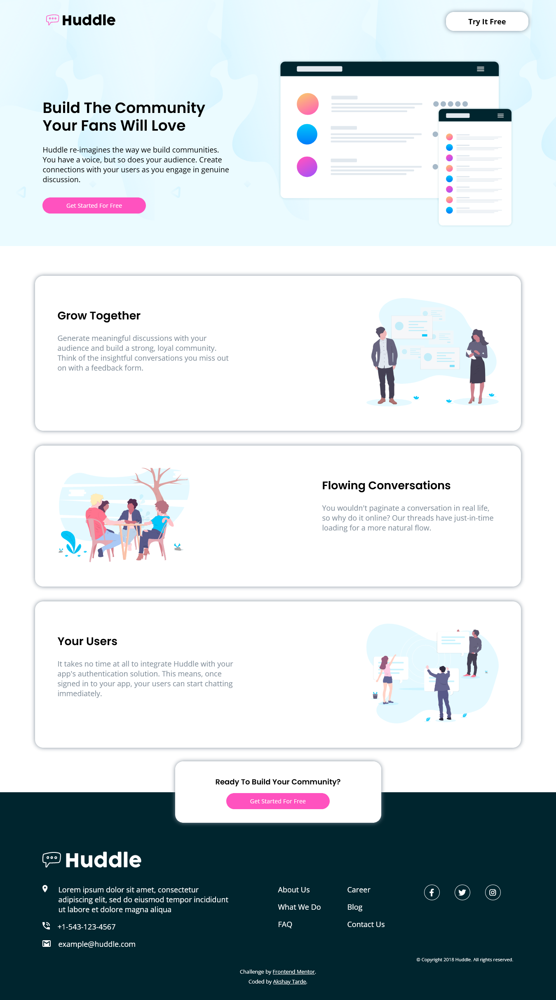
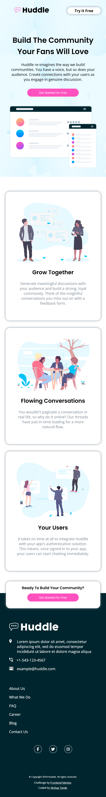

# Frontend Mentor - Huddle landing page with alternating feature blocks solution

This is a solution to the [Huddle landing page with alternating feature blocks challenge on Frontend Mentor](https://www.frontendmentor.io/challenges/huddle-landing-page-with-alternating-feature-blocks-5ca5f5981e82137ec91a5100). Frontend Mentor challenges help you improve your coding skills by building realistic projects. 

## Table of contents

- [Overview](#overview)
  - [The challenge](#the-challenge)
  - [Screenshot](#screenshot)
  - [Links](#links)
- [My process](#my-process)
  - [Built with](#built-with)
  - [What I learned](#what-i-learned)
- [Author](#author)

## Overview

### The challenge

Users should be able to:

- View the optimal layout for the site depending on their device's screen size
- See hover states for all interactive elements on the page

### Screenshot

Desktop Layout

Mobile Layout

### Links

- Solution URL: [Frontend Mentor](https://www.frontendmentor.io/solutions/responsive-huddle-landing-page-gC37_BnXc1)
- Live Site URL: [Huddle Landing Page with alternating feature blocks](https://huddle-landing-alternative.netlify.app/)

## My process

I approached this layout by dividing into three sections, viz., header, card-section and footer. 
I used flexbox to style most components.
Grid was also used to place a section in the footer.

### Built with

- Semantic HTML5 markup
- CSS custom properties
- Flexbox
- CSS Grid
- Mobile-first workflow

### What I learned

I learned how to change the color of an inline SVG.
I also learned about making responsive components with position:absolute set to them. 

## Author

- Frontend Mentor - [@Akshay-Tarde](https://www.frontendmentor.io/profile/Akshay-Tarde)